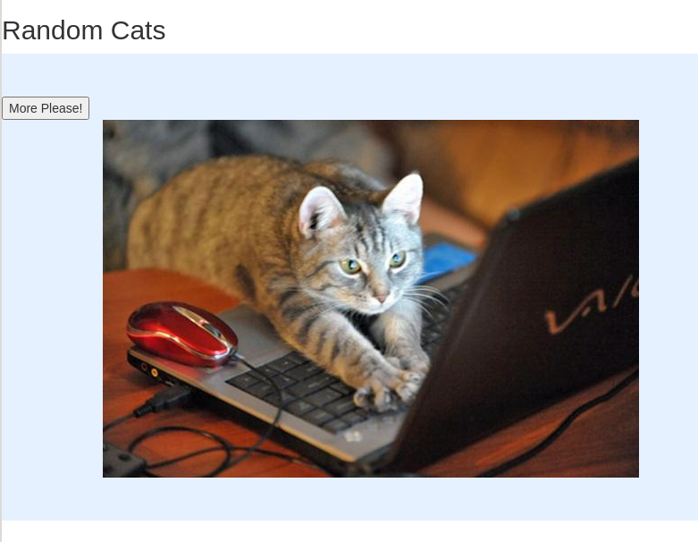

## learning elm



```bash
curl -L -o elm.gz https://github.com/elm/compiler/releases/download/0.19.1/binary-for-linux-64-bit.gz
```

-- https://github.com/elm/compiler/blob/master/hints/init.md

Dev
```bash
elm init
elm reactor
```

Make
```bash
elm make src/Cats.elm --optimize --output=Cats.html
```

Optimize
```bash
# optimized
elm make src/Cats.elm --optimize --output=docs/elm.js
# debug build
elm make src/Cats.elm --debug --output=docs/elm.js
# minify
uglifyjs docs/elm.js --compress 'pure_funcs=[F2,F3,F4,F5,F6,F7,F8,F9,A2,A3,A4,A5,A6,A7,A8,A9],pure_getters,keep_fargs=false,unsafe_comps,unsafe' | uglifyjs --mangle --output docs/elm.min.js
```

Run
```bash
./gen-index.sh
serve docs
```
